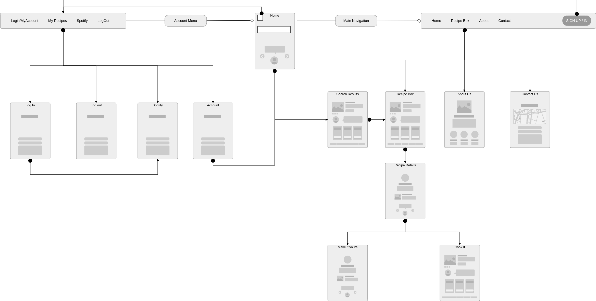
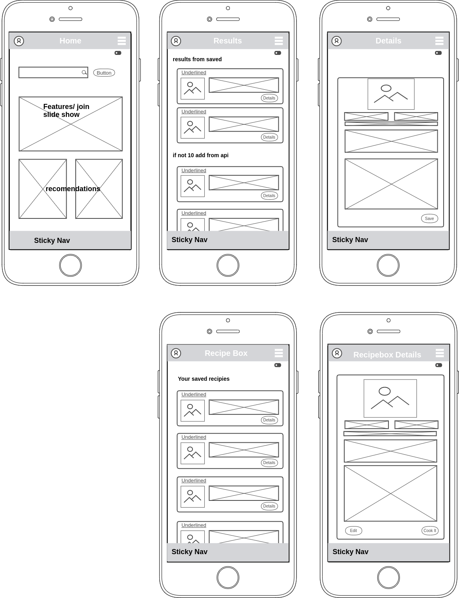
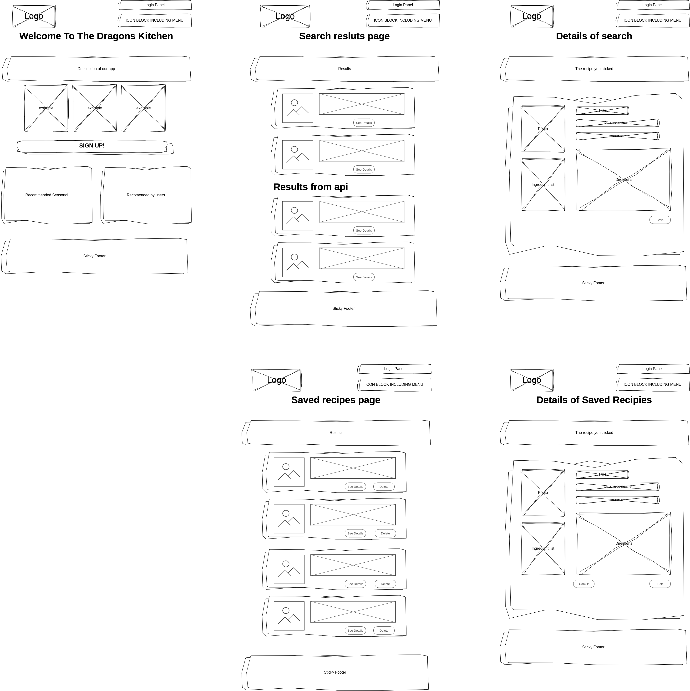
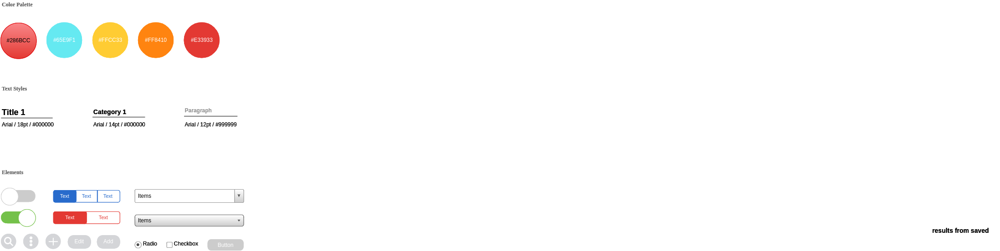

# the-dragons-kitchen

**Author**: Matt Ravenmoore
**Current Version**: 0.6.1

## Overview

A not so simple kitchen life helper app for mobile tablet and desktop use.

## Getting Started

1. clone Repo to local.
1. install the Dependancies useing 'npm i' or individualy
1. create a postgress database for the project for local testing and link the .sql files.

## Architecture

Currently using:

dependancies:

* "cors": "^2.8.5",
* "dotenv": "^8.2.0",
* "ejs": "^3.1.5",
* "express": "^4.17.1",
* "method-override": "^3.0.0",
* "pg": "^8.4.1",
* "superagent": "^6.1.0"
* "express-openid-connect"

AIPs and Other:

* heroku (deployment)
* Auth0: user authentication portal and db.

Languages:

* javascript
* css
* html

## Change Log

* version--0.0.2 10-08-2020 12:00 PST  Design plan in place, theme to be decided, documentation in place.
* version--0.1.0 10-09-2020 15:00 PST  CSS prof of life server working and db talking.
* version--0.2.0 10-10-2020 16:55 PST Home page has some basic content and a working slideshow with place holder images.
* version--0.2.1 10-10-2020 21:45 PST the web app can now store user informations and retrive user infromation from the database. user funtionality still in progress.
* version--0.3.0 10-11-2020 17:15 PST The web app now more securely deals with user auth via Auth0, interface and account see more below.
* version--0.4.1 10-11-2020 22:00 PST TDK now has error catching, and can get back a list of recipes from the api and display them.
* version--0.4.2 10-12-2020 22:30 PST TKD now will show results and details road paved for storage and retrival.
* version--0.4.4 10-13-2020 22:05 PST TKD has the start to a style and look work in progres.
* version--0.5.1 10-22-2020 01:00 PST TKD can now store usersaved recipes to dependant accounts with no repeating in the db.
* version--0.5.2 10-27-2020 21:00 PST colors and fonts made live for designers
* version--0.5.3 10-28-2020 13:24 PST the navigation have been made user friendly
* version--0.6.1 10-29-2020 20:45 PST Main css and theme uploaded and built most of main functions are built and i am setting up for peer review.
* version--0.7.1 11-06-2020 02:30 PST Crud functionality working. major bugs caught.

## Project Scope

This will be a kitchen helping utility. Beginning with a user login/create account experience. continuing with a recipe finding, saving, and creating functionality. there will be implementation of a music feature bringing music themed playlists from spotify based on the recipe you are cooking. the user will aslo be able to view videos of popular chefs from youtube making the dish of choice from their box.

## Planned Feature List

[features INFO](./readme/features.md)

## Site layout

a general site plan

the mobile looks should end up like this:

the desktop version should look close to this:

this style guide is a template to be worked on as i get ideas:

## Credits and Collaborations

Logo design by Jeremy Odden 2020,
image attribution for smoke in logo Designed by pch.vector

w3 schools

[slideshow frame work and js](https://www.w3schools.com/howto/howto_js_slideshow.asp)

apis and auth handlers
[spoonacular](spoonacular.com/food-api)
[auth0](auth0.com)
