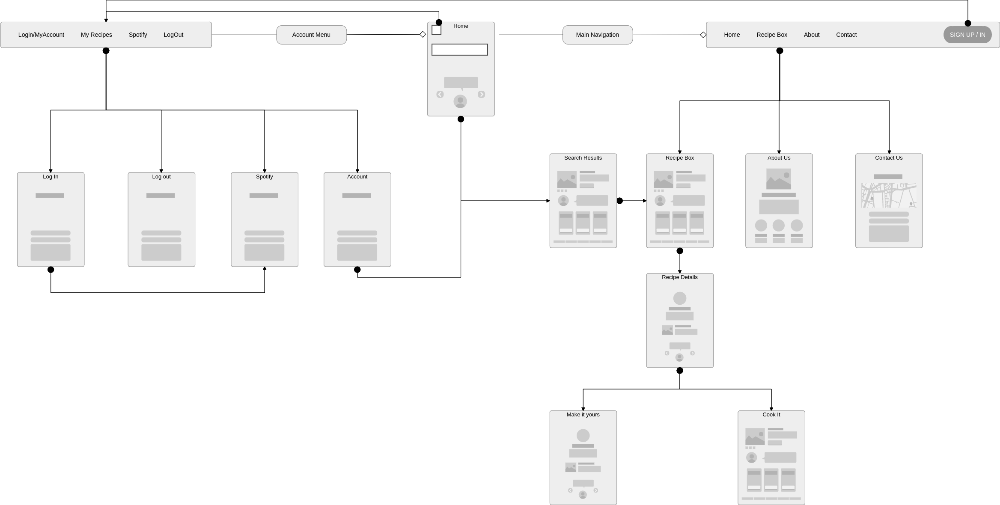
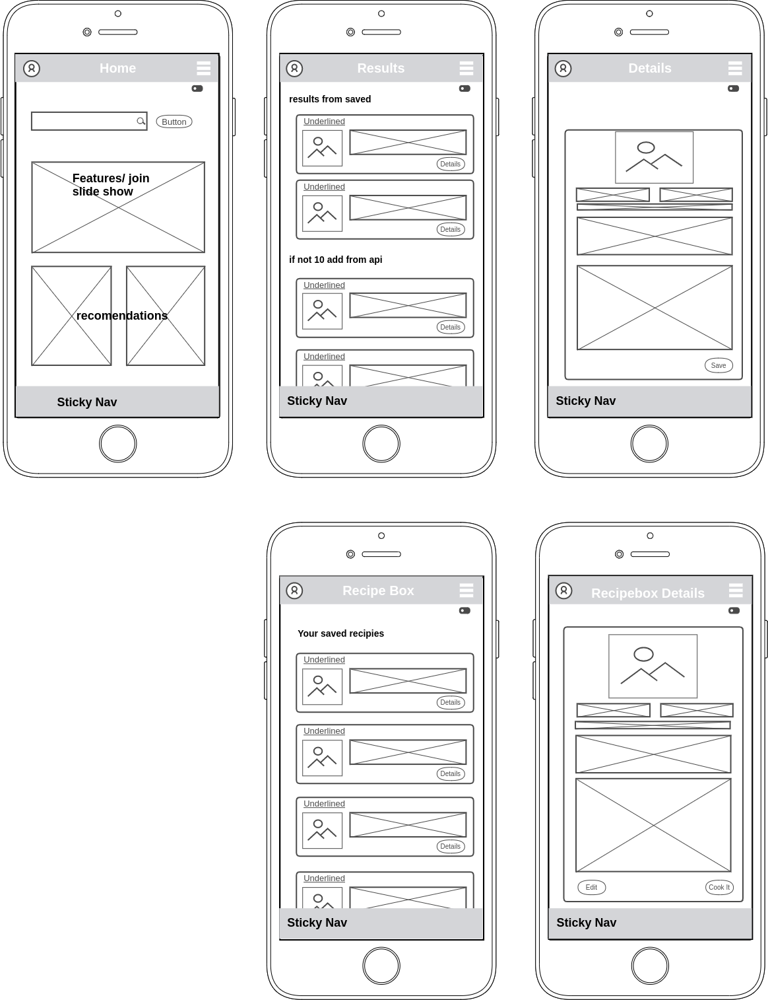
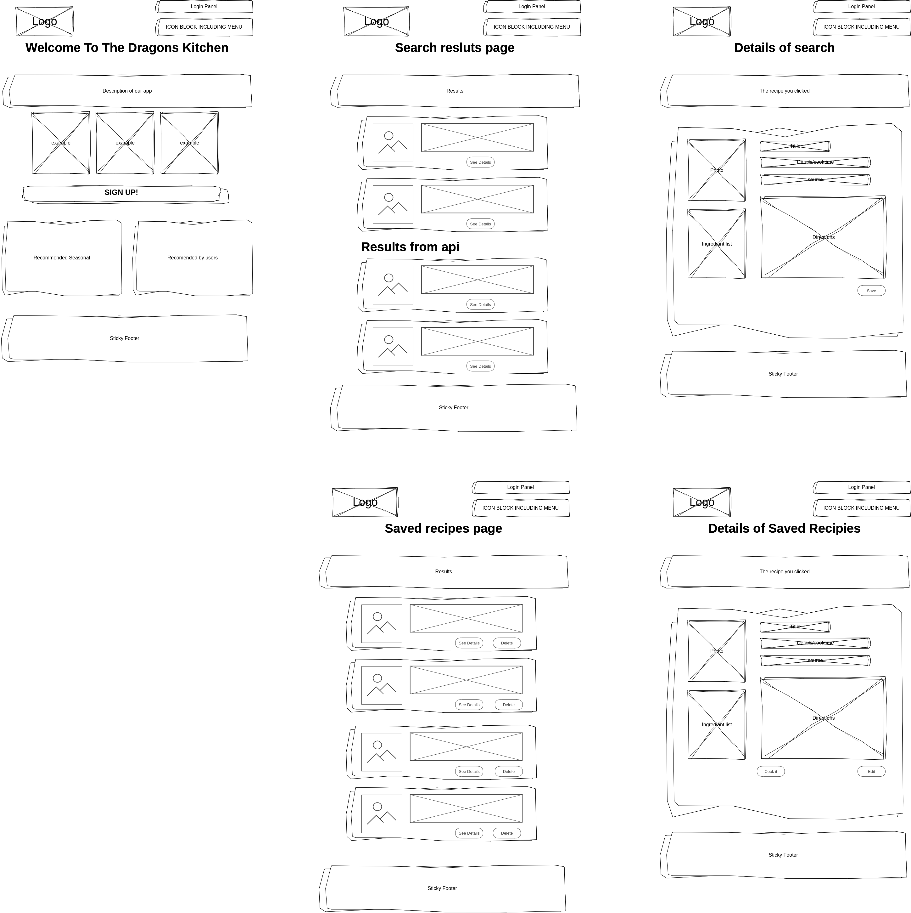
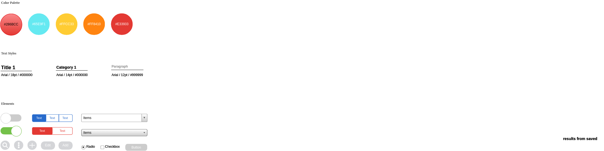

# the-dragons-kitchen

**Author**: Matt Ravenmoore
**Current Version**: 0.0.2

## Overview

This will be a kitchen helping utility. begining with a user login/create account experience. contiuing with a recipie finding, saving, and creating functionality. there will be implementation of a music feature bringing music themed playlists from spotify based on the recipe you are cooking. the user will aslo be able to view videos of popular chefs from youtube making the dish of choice from their box.

## Getting Started

1. clone Repo to local.
1. install the Dependancies useing 'npm i' or individualy:

* "cors": "^2.8.5",
* "dotenv": "^8.2.0",
* "ejs": "^3.1.5",
* "express": "^4.17.1",
* "method-override": "^3.0.0",
* "pg": "^8.4.1",
* "superagent": "^6.1.0"

1. create a postgress database for the project for local testing and link the .sql files in order:

* schema

## Architecture

Currently using:

* node.js
  * express
  * cors
  * ejs
* JavaScript
* heroku
* superAgent
* postgres

## Change Log

* version--0.0.2--10-08-2020 12:00pm PST  Design plan in place, theme to be decided, documentation in place.

## planed feature list

* user login and accounts
* recipe db table per user
* recipe finder with multipul options for getting meals including:
  * random meal (up to 3)
  * meal by main ingrediant (max 10)
  * meal by xx
* shopping list maker (from ingrediant lists)
* expand shoping list for meal planning future feature
* connect to spotify via account page
  * if connected on cookit page generate 5 playlists based on some aspect of the meal
* have top 5 video results from youtube display below directions or in sidebar durring cook this.
* timer with mobile compatiblity
* top 10 site searches section on home
* seasonal sugestion section on home

### **streach goal**

* db of factoids food and regon related for use in the cook me page or other places in the app.

## Site layout

a general site plan

the mobil looks sholuld end up like this:

the desktop version should look close to this:

## work log

[Worklog](worklog.md)

this style guide is a template to be worked on as i get ideas:

## Credits and Collaborations
